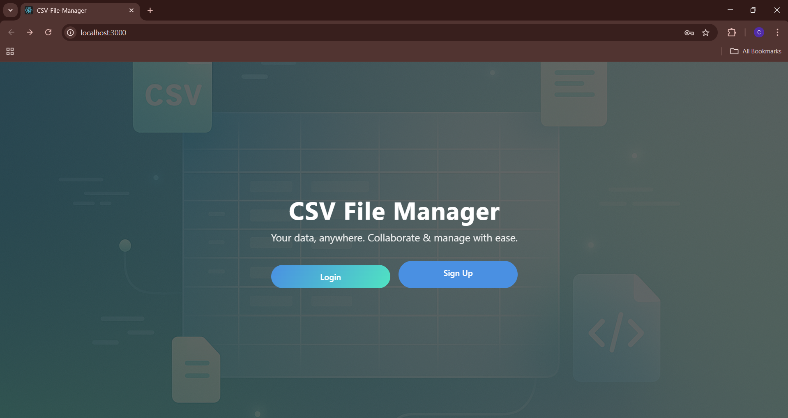
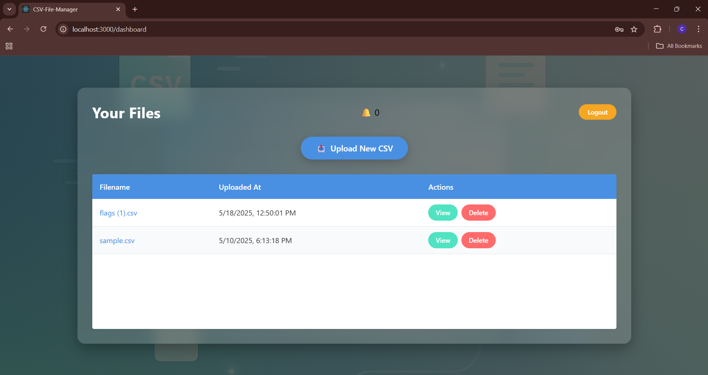
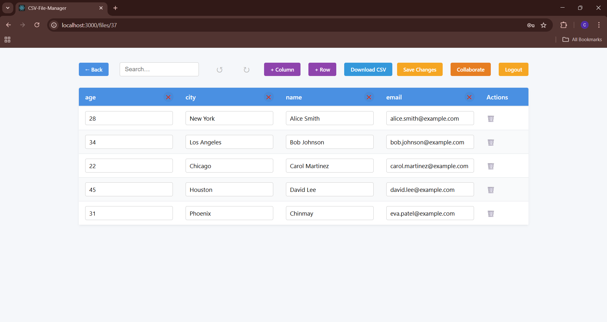

# 📊 CSV Collab Manager

A full-stack web application that allows users to upload, manage, and collaboratively edit CSV files in a user-friendly interface. Includes authentication, protected routes, and token-based authorization using JWT.

## 🚀 Features

- 🔐 User Authentication (JWT-based)
- 🗃️ Upload and Manage CSV Files
- 📑 Real-time CSV Editing Interface
- 🧾 Preview and Export Edited Files
- 📥 Backend API with Express.js
- ⚛️ Frontend with React + Context API
- 🛡️ Protected Routes & Auth Context
- 💾 Token stored securely in `localStorage`


## 🛠️ Tech Stack

Frontend:
- React
- React Router
- Context API
- Axios

Backend:
- Node.js
- Express.js
- JWT for Auth
- Multer for File Uploads

---

## 🧰 Getting Started

### 🔹 Clone the Repository

```bash
git clone https://github.com/your-username/csv-collab-manager.git
cd csv-collab-manager
```
### 🔹 Set Up the Backend

```bash
cd backend
npm install

```
### 🔹 Create a .env file inside the backend directory:

JWT_SECRET=your_secret_key_here

### 🔹 Start the backend server: 

```bash
node index.js

```

### 🔹 Set Up the Frontend

```bash
cd frontend
npm install
npm start

```

### 🔹 Now you’re ready!

Visit http://localhost:3000,
Sign up or log in,
Upload and manage CSV files!

### 📊 Home


### 📊 Dashboard


### 📊 Table
